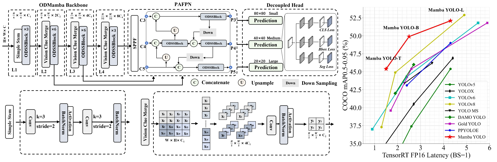

# [AAAI2025] Mamba YOLO: A Simple Baseline for Object Detection with State Space Model

  [](README.md)


<div align="center">
  
</div>

## Model Zoo

We've pre-trained YOLO-World-T/M/L from scratch and evaluate on the `MSCOCO2017 val`. 

### Inference on MSCOCO2017 dataset


| model | Params| FLOPs | ${AP}^{val}$ | ${AP}_{{50}}^{val}$ | ${AP}_{{75}}^{val}$ | ${AP}_{{S}}^{val}$ | ${AP}_{{M}}^{val}$ | ${AP}_{{L}}^{val}$ |
| :------------------------------------------------------------------------------------------------------------------- | :------------------- | :----------------- | :--------------: | :------------: | :------------: | :------------: | :-------------: | :------------: |
| [Mamba YOLO-T](./ultralytics/cfg/models/mamba-yolo/Mamba-YOLO-T.yaml) | 5.8M | 13.2G |       44.5       |          61.2           |          48.2           |          24.7          |          48.8          |          62.0          |
| [Mamba YOLO-M](./ultralytics/cfg/models/mamba-yolo/Mamba-YOLO-B.yaml) | 19.1M | 45.4G  |       49.1       |          66.5           |          53.5           |          30.6          |          54.0          |          66.4          |
| [Mamba YOLO-L](./ultralytics/cfg/models/mamba-yolo/Mamba-YOLO-L.yaml)  | 57.6M | 156.2G |       52.1       |          69.8           |          56.5           |          34.1          |          57.3          |          68.1          |


## Getting started

### 1. Installation

Mamba YOLO is developed based on `torch==2.3.0` `pytorch-cuda==12.1` and `CUDA Version==12.6`. 

#### 2.Clone Project 

```bash
git clone https://github.com/HZAI-ZJNU/Mamba-YOLO.git
```

#### 3.Create and activate a conda environment.
```bash
conda create -n mambayolo -y python=3.11
conda activate mambayolo
```

#### 4. Install torch

```bash
pip3 install torch===2.3.0 torchvision torchaudio
```

#### 5. Install Dependencies
```bash
pip install seaborn thop timm einops
cd selective_scan && pip install . && cd ..
pip install -v -e .
```

#### 6. Prepare MSCOCO2017 Dataset
Make sure your dataset structure as follows:
```
├── coco
│   ├── annotations
│   │   ├── instances_train2017.json
│   │   └── instances_val2017.json
│   ├── images
│   │   ├── train2017
│   │   └── val2017
│   ├── labels
│   │   ├── train2017
│   │   ├── val2017
```

#### 7. Training Mamba-YOLO-T
```bash
python mbyolo_train.py --task train --data ultralytics/cfg/datasets/coco.yaml \
 --config ultralytics/cfg/models/mamba-yolo/Mamba-YOLO-T.yaml \
--amp  --project ./output_dir/mscoco --name mambayolo_n
```

## Acknowledgement

This repo is modified from open source real-time object detection codebase [Ultralytics](https://github.com/ultralytics/ultralytics). The selective-scan from [VMamba](https://github.com/MzeroMiko/VMamba).

## Citations
If you find [Mamba-YOLO](https://github.com/HZAI-ZJNU/Mamba-YOLO) is useful in your research or applications, please consider giving us a star 🌟 and citing it.

```bibtex
@misc{wang2024mambayolossmsbasedyolo,
      title={Mamba YOLO: SSMs-Based YOLO For Object Detection}, 
      author={Zeyu Wang and Chen Li and Huiying Xu and Xinzhong Zhu},
      year={2024},
      eprint={2406.05835},
      archivePrefix={arXiv},
      primaryClass={cs.CV},
      url={https://arxiv.org/abs/2406.05835}, 
}
```
